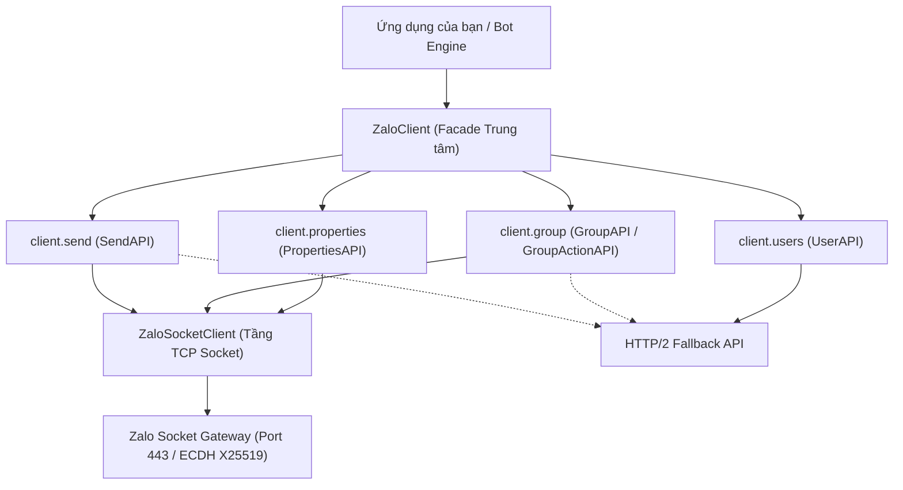

# HƯỚNG DẪN LẬP TRÌNH TOÀN DIỆN VỚI ZALO CORE SDK (SDK_GUIDE.md)

Tài liệu này cung cấp hướng dẫn chuyên sâu về kiến trúc, các lớp đối tượng, danh mục phương thức (API Reference) và các hướng dẫn kỹ thuật khi tích hợp bộ thư viện **Zalo Core SDK** vào dự án của bạn.

---

## MỤC LỤC

1. [Kiến trúc tổng quan (Architecture Overview)](#1-kiến-trúc-tổng-quan)
2. [Hướng dẫn sao chép sang máy cá nhân (Export & Setup)](#2-hướng-dẫn-sao-chép-sang-máy-cá-nhân)
3. [Xác thực & Khởi tạo phiên (Session Management)](#3-xác-thực--khởi-tạo-phiên)
4. [Tài liệu API chi tiết (API Reference)](#4-tài-liệu-api-chi-tiết)
   - [ZaloClient (Entrypoint)](#zaloclient)
   - [SendAPI (Gửi tin & Tương tác)](#sendapi)
   - [GroupAPI & GroupActionAPI (Quản trị nhóm)](#groupapi--groupactionapi)
   - [GroupMessageAPI (Ghim & Bình chọn)](#groupmessageapi)
   - [UserAPI (Hồ sơ người dùng)](#userapi)
   - [PropertiesAPI (Trạng thái & TTL)](#propertiesapi)
5. [Đặc tả giao thức mạng tầng thấp (Low-Level Protocol)](#5-đặc-tả-giao-thức-mạng-tầng-thấp)
6. [Best Practices khi xây dựng Bot & Automation](#6-best-practices)

---

## 1. KIẾN TRÚC TỔNG QUAN

Zalo Core SDK được thiết kế mô phỏng chính xác hành vi của ứng dụng **Zalo Mobile Native (Android/iOS)**:



### Điểm đặc sắc về công nghệ:
1. **Zero Hardcoded Paths**: Tự động giải quyết đường dẫn phiên trên mọi hệ điều hành (Windows `C:\...`, macOS `/Users/...`, Linux `/home/...`).
2. **In-Memory Dictionary Sessions**: Nạp trực tiếp thông tin xác thực từ RAM (biến môi trường, Redis, cơ sở dữ liệu) mà không cần ghi file vật lý.
3. **Dynamic PROV Handshake**: Tự động sinh khóa trao đổi X25519 và mã hóa AES-256-GCM 2 tầng khi kết nối Socket Gateway.
4. **Push Notification Decompressor**: Hỗ trợ giải nén Gzip thời gian thực cho các bản tin Broadcast/Push (CMD 201, 1867).

---

## 2. HƯỚNG DẪN SAO CHÉP SANG MÁY CÁ NHÂN

Khi bạn tải mã nguồn từ máy chủ về máy tính cá nhân (hoặc clone qua Git):

### Bước 1: Sao chép thư mục
Chỉ cần sao chép toàn bộ thư mục `zalo/` về máy của bạn.

### Bước 2: Cài đặt thư viện phụ thuộc
Mở Terminal / PowerShell tại thư mục dự án và chạy:

```bash
# Tạo môi trường ảo (Khuyến nghị)
python -m venv .venv

# Kích hoạt môi trường ảo:
# Trên Windows:
.venv\Scripts\activate
# Trên Linux/macOS:
source .venv/bin/activate

# Cài đặt dependencies
pip install -r requirements.txt

# Cài đặt SDK
pip install -e .
```

### Bước 3: Đăng nhập hoặc mang theo file session
- Nếu bạn đã có file `fresh_session.json` từ trước, chỉ cần đặt cùng thư mục với script của bạn hoặc vào thư mục `~/.zalo/fresh_session.json`.
- Nếu chưa có session, chạy lệnh đăng nhập:
  ```bash
  python -m core.login
  ```

---

## 3. XÁC THỰC & KHỞI TẠO PHIÊN

### Nạp session từ file mặc định (Auto-discovery)
```python
from core import ZaloClient

# Tự động tìm kiếm fresh_session.json ở thư mục hiện tại hoặc ~/.zalo/
client = ZaloClient()
client.connect()

# Đóng kết nối khi hoàn tất
client.close()
```

### Nạp session từ đường dẫn tùy ý
```python
client = ZaloClient(session="duong_dan_den_session_cua_ban.json")
client.connect()
```

### Nạp session từ Dictionary trong bộ nhớ (Cloud / Redis / Database)
```python
import os
import json
from core import ZaloClient

# Lấy session JSON từ Redis hoặc biến môi trường
raw_session_json = os.environ.get("ZALO_SESSION_JSON")
session_dict = json.loads(raw_session_json)

# Khởi tạo client trực tiếp với dictionary
client = ZaloClient(session=session_dict)
client.connect()
```

---

## 4. TÀI LIỆU API CHI TIẾT (API REFERENCE)

### `ZaloClient`

Lớp facade trung tâm quản lý vòng đời kết nối và điều phối các dịch vụ con.

```python
ZaloClient(
    session: Optional[Union[str, Dict[str, Any]]] = None,
    frame0_path: Optional[str] = None,
    debug: bool = False
)
```

#### Phương thức chính:
- `client.start() -> bool`: Khởi tạo kết nối Socket, thực hiện Handshake và kích hoạt session.
- `client.stop()`: Đóng an toàn kết nối Socket và hủy các luồng ngầm.
- `client.on_message(callback: Callable[[Message], None])`: Đăng ký hàm lắng nghe tin nhắn đến theo thời gian thực.
- `client.uid`: Lấy UID (User ID) của tài khoản hiện tại.

---

### `SendAPI` (`client.send`)

Quản lý tất cả các hoạt động gửi tin nhắn, định dạng chữ và tương tác.

#### `send_text`
```python
client.send.send_text(
    target_id: Union[int, str],
    text: str,
    thread_type: ThreadType = ThreadType.USER,
    mentions: Optional[List[Dict[str, Any]]] = None,
    quote_msg: Optional[Dict[str, Any]] = None,
    color: Optional[str] = None,
    bold: bool = False,
    italic: bool = False,
    underline: bool = False,
    strike_through: bool = False,
    font_size: Optional[str] = None,
    ttl_ms: int = 0
) -> Dict[str, Any]
```
- **target_id**: ID người nhận (UID 1-1) hoặc ID nhóm (Group ID).
- **text**: Nội dung văn bản tin nhắn.
- **thread_type**: `ThreadType.USER` (tin cá nhân) hoặc `ThreadType.GROUP` (tin nhóm).
- **mentions**: Danh sách gắn thẻ người dùng: `[{"uid": 123456, "pos": 0, "len": 4}]`.
- **quote_msg**: Dữ liệu tin nhắn được trích dẫn (xem `build_quote_object`).
- **color**: Mã màu Hex (VD: `"#FF0000"` cho màu đỏ, `"#007AFF"` cho màu xanh Zalo).
- **font_size**: Cỡ chữ: `"14px"`, `"16px"`, `"18px"`, `"24px"`.

#### `send_reaction`
```python
client.send.send_reaction(
    target_id: Union[int, str],
    server_msg_id: Union[int, str],
    reaction_icon: ReactionIcon = ReactionIcon.LIKE,
    thread_type: ThreadType = ThreadType.USER
) -> bool
```
- **reaction_icon**: `ReactionIcon.LIKE`, `ReactionIcon.LOVE`, `ReactionIcon.HAHA`, `ReactionIcon.WOW`, `ReactionIcon.SAD`, `ReactionIcon.ANGRY`.

---

### `GroupAPI` & `GroupActionAPI` (`client.group` / `client.group_action`)

Quản lý thông tin và các hành động điều hành nhóm chat.

#### `join_group` (Vạn năng)
```python
client.group.join_group(
    target: Union[str, int],
    msg: str = "",
    source: int = 1
) -> Dict[str, Any]
```
- Tự động nhận diện nếu `target` là đường link mời (VD: `https://zalo.me/g/wrrzniqqwideocuiclly` hoặc `wrrzniqqwideocuiclly`) hay là Group ID số nguyên (VD: `700852067`).
- Gửi gói tin socket chuẩn **CMD 244 SUB 4** và **CMD 2000 SUB 3**.

#### `leave_group`
```python
client.group_action.leave_group(group_id: Union[int, str]) -> bool
```
- Thoát khỏi nhóm chat chỉ định với mã nhị phân **CMD 225 SUB 3** (`bb=0, ty=1`).

#### `kick_member`
```python
client.group_action.kick_member(group_id: Union[int, str], member_uid: Union[int, str]) -> bool
```
- Xóa thành viên khỏi nhóm chat (**CMD 234**).

#### `ban_member`
```python
client.group_action.ban_member(group_id: Union[int, str], member_uid: Union[int, str]) -> bool
```
- Chặn thành viên không cho quay lại nhóm (**CMD 236**).

#### `add_member`
```python
client.group_action.add_member(group_id: Union[int, str], members: List[Union[int, str]]) -> bool
```
- Mời danh sách UID vào nhóm (**CMD 235**).

#### `disband_group`
```python
client.group_action.disband_group(group_id: Union[int, str]) -> bool
```
- Giải tán toàn bộ nhóm chat (**CMD 242**).

---

### `GroupMessageAPI` (`client.group_message`)

#### `pin_topic` / `unpin_topic`
```python
# Ghim tin nhắn / chủ đề
client.group_message.pin_topic(
    group_id: Union[int, str],
    content: str,
    creator_uid: Optional[int] = None
) -> bool

# Bỏ ghim tin nhắn
client.group_message.unpin_topic(group_id: Union[int, str]) -> bool
```

#### `create_poll`
```python
client.group_message.create_poll(
    group_id: Union[int, str],
    question: str,
    options: List[str],
    allow_multiple: bool = False,
    allow_add_options: bool = True,
    expires_at_ms: int = 0
) -> bool
```

---

### `UserAPI` (`client.users`)

Tra cứu và quản lý thông tin hồ sơ tài khoản.

#### `get_user_info`
```python
user_profile = client.users.get_user_info(uid: Union[int, str]) -> Optional[UserProfile]
```
Trả về đối tượng `UserProfile` với các thuộc tính:
- `user_profile.uid`: UID người dùng.
- `user_profile.display_name`: Tên hiển thị tốt nhất.
- `user_profile.zalo_name`: Tên đăng ký gốc trên Zalo.
- `user_profile.gender`: `Gender.MALE`, `Gender.FEMALE`, `Gender.UNKNOWN`.
- `user_profile.dob`: Ngày tháng năm sinh (Định dạng: `YYYY-MM-DD`).
- `user_profile.avatar_url`: URL ảnh đại diện kích thước lớn.

---

### `PropertiesAPI` (`client.properties`)

#### `send_typing`
```python
client.properties.send_typing(
    target_id: Union[int, str],
    thread_type: ThreadType = ThreadType.USER,
    is_typing: bool = True
) -> bool
```

#### `set_conversation_ttl`
```python
client.properties.set_conversation_ttl(
    target_id: Union[int, str],
    thread_type: ThreadType = ThreadType.USER,
    ttl_seconds: int = 0
) -> bool
```

---

## 5. ĐẶC TẢ GIAO THỨC MẠNG TẦNG THẤP

### Sơ đồ luồng Handshake & Mã hóa Khung (Frame Encoding)

```text
[Khởi tạo Socket TCP]
        │
        ▼
[Frame 0: PROV Type 8] ──> ECDH X25519 Trao đổi Public Key
        │
        ▼
[Burst Khởi tạo Session] ──> Gửi tuần tự các bản tin cấu hình (CMD 384, 2061, 133, 2070, 1430, 151...)
        │
        ▼
[Active Session Hoàn tất] ──> Chuyển sang chế độ trao đổi dữ liệu D3 nhị phân
```

### Bảng đối chiếu mã lệnh Socket (Socket CMD Map - Verified 09/2026)

| Việc / Nghiệp vụ | CMD / SUB | Params plaintext (sau GCM, trước/sau XOR) | Ghi chú kỹ thuật |
|---|---|---|---|
| **Xoá khỏi nhóm (toggle TẮT)** | `228/0` (`du/b.r`) | `gid:u32 + uid:u32*` (không count/flag) | Nút "Xoá khỏi nhóm" thật. SDK: `remove_member()` |
| **Block/chặn (toggle BẬT)** | `234/0` (`pn/g0.k`) | `gid:u32 + flag:u8(1) + count:u32 + uids` | `flag 0` gần như không dùng. SDK: `kick_member(is_block=True)` / `block_group_member()` |
| **Rời nhóm** | `225/3` (`du/b.g`, `pn/g0.N0`) | `01 + vercode:u32 + 0:u32 + lang:u16(0) + gid:u32 + 0x00A0:u16 + 0:u16` | C2S 19B. SDK đúng |
| **Giải tán nhóm** | `242/0` (`pn/g0.h2`) | `01 + vercode:u32 + gid:u32` | Trước đây alias nhầm sang 1705, đã sửa |
| **Join qua link** | `244/4` (`pn/g0.n2`) | `01 + ver + 0:u32 + lang:u16 + gid:u32 + msg:l3 + source:u32(1) + sub:u8(0) + link:l3 FULL URL` | BẮT BUỘC có gid + full `https://zalo.me/g/...`; `gid=0` trả ACK rỗng |
| **Fetch config nhóm** | `2000/0` | `01 + ver + 0:u32 + lang + gid + flag:u8` | Fetch cấu hình/dữ liệu, không phải join |
| **Bình chọn / Ghim / Thả tim** | `1705` / `1701` / `1785` | Binary TLV & JSON Payload | CMD `246/250` là board/poll/invite |

---

## 6. BEST PRACTICES KHI XÂY DỰNG BOT & AUTOMATION

1. **Anti-Loop Protection**:
   Luôn kiểm tra `if msg.from_uid == client.uid: return` trong callback tin nhắn để tránh bot tự phản hồi chính nó gây bão tin nhắn.

2. **Per-User Rate Limiting**:
   Nên đặt khoảng cách tối thiểu giữa các lệnh (khuyến nghị `1.0s` - `1.5s` mỗi người dùng) để duy trì sự ổn định cho tài khoản.

3. **Xử lý ngắt kết nối an toàn (Graceful Shutdown)**:
   Đăng ký bắt tín hiệu `SIGINT` / `KeyboardInterrupt` để gọi `client.close()`, đảm bảo Socket TCP được đóng đúng quy trình và giải phóng tài nguyên.

4. **Triển khai Production / Docker**:
   Truyền `session` dưới dạng dictionary trực tiếp từ biến môi trường hoặc Redis để container có thể khởi động tức thì mà không phụ thuộc vào ổ cứng.

---

## 7. GHI CHÚ CHO AGENT (REVERSE TỪ SMALI + PCAP THỰC TẾ, 09/2026)

Workflow chuẩn: `LDPlayer (root, adb) -> pull zaloprefs + pcap PCAPdroid -> parse zaloprefs lấy UID/DK/CryptKey -> decode pcap bằng DK (GCM outer + XOR inner) -> login pass/CLI khi cần session mới -> test socket live (đọc ACK) -> đối chiếu smali`.

### Rời nhóm (leave) chi tiết — đọc kỹ trước khi test
- **Lệnh**: `225/3` (`du/b.g`, `pn/g0.N0`), C2S luôn 19B: `01 + vercode:u32(260802903) + 0:u32 + lang:u16(0) + gid:u32 + 0x00A0:u16(160) + 0:u16`. Chỉ gid thay đổi theo nhóm (pcap verify: `701210986`, `692675055`, `701500272`).
- **S2C ACK**: `status:i32` 4B đầu (=0 là server đã nhận) + ~1–1.3KB payload (snapshot state, chưa parse — độ dài tăng dần 1034→1357B trong pcap, đừng dùng để kết luận).
- **`status 0` / `send True` KHÔNG có nghĩa đã out**: live test rời `701210986` và `701514047` đều ACK `status 0`, `send_message` sau đó vẫn `True` (True chỉ = socket đã gửi). Verify thật bằng: member list trong app, hoặc bot còn nhận push `201`/tin mới của nhóm đó không.
- **Owner không rời được**: smali không check client-side, server trả `0x426f NOT_AUTHORIZED`. Nhóm nào bot là chủ (vd `692675055` "Bot là chủ nhóm") thì leave sẽ ACK 0 nhưng vẫn ở lại — phải chuyển quyền hoặc giải tán (`242`) thay vì leave.
- **Rời rồi muốn vào lại**: join lại bằng `244` kèm gid + full link đã biết (đã verify rejoin `701210986` OK). Không dùng `gid=0`.
- Pcap có tới 18 cặp leave C2S/S2C vì user spam leave lúc capture — khi thấy leave lặp đi lặp lại cùng gid mà member vẫn còn thì hiểu là 1 trong các trường hợp trên.

### Bẫy kỹ thuật đã gặp (đừng lặp lại)
1. **C2S params bị XOR 2 lớp** (`xor_enc`: keystream `XK ^ le32(len+23) ^ le32(uid)`); **S2C ACK thì KHÔNG XOR** (đọc `status:i32` trực tiếp 4B đầu; 4 byte tiếp theo ở offset 4 là Server Timestamp/Ticket Time). Muốn so builder với pcap phải XOR-decode C2S trước.
2. **Gid phải biết trước khi join**: `244 gid=0` luôn ACK `len 123` rỗng, không resolve. Lấy gid từ lịch sử chat (`201/38` recommend-link), invite push `201`, hoặc HTTP `GROUP_API_INFO` (`group.api.zaloapp.com`), rồi gửi `244` kèm gid + full URL + `source=1` (đã verify: `ld5v...->701500272`, `krgx...->701210986`).
3. **ACK `status 0` ≠ thành công thật**: `send_*` trả `True` chỉ nghĩa là socket đã gửi. Verify bằng cách: nghe push `201`, gửi tin thử, hoặc check member list trong app.
4. **Thiếu `Union` import** (`protocol.py`, `socket/client.py`) làm crash Python 3.11 — đã thêm.
5. **ACK listener thiếu CMD** thì `_wait_cmd_ack` treo tới timeout: `228`/`242` đã được thêm vào list ở `socket/client.py`.
6. **Facade vs socket**: `ZaloClient.connect()/close()` (không phải `start/stop`); gửi tin nhóm là `send_message(thread_id, text, thread_type=GROUP)` (không có `send_text`); `leave_group` facade đã hỗ trợ `wait_response`.
7. **Login xoay DK**: mỗi lần `login.py` thành công là 1 `ksid`/DK mới, session file cũ hết hiệu lực. Dùng `live_session.json` (từ zaloprefs, offline) khi không muốn đá session thiết bị; dùng `login_session*.json` mới nhất khi cần chạy socket PC.
8. **Pcap chỉ giải được socket custom** (CONNECT + frame GCM). 54/56 flows là TLS pinning, PCAPdroid/Reqable MITM không bóc được — đừng cố.

### Lệnh main.py chuẩn
```bash
# nghe để lấy UID/group mới
python main.py --session login_session3.json --listen --duration 180
# xoá (228) / block (234) / rời (225) / giải tán (242) / join link (244)
python main.py --session <json> --group <GID> --kick <UID>     # 228, không block
python main.py --session <json> --group <GID> --ban <UID>      # 234 flag 1
python main.py --session <json> --leave <GID>                  # 225, đọc ACK success
python main.py --session <json> --disband --group <GID>        # 242
python main.py --session <json> --join https://zalo.me/g/<code> --group <GID>  # 244 cần gid
python main.py --session <json> --group <GID> --msg "text"     # nhắn nhóm
```
